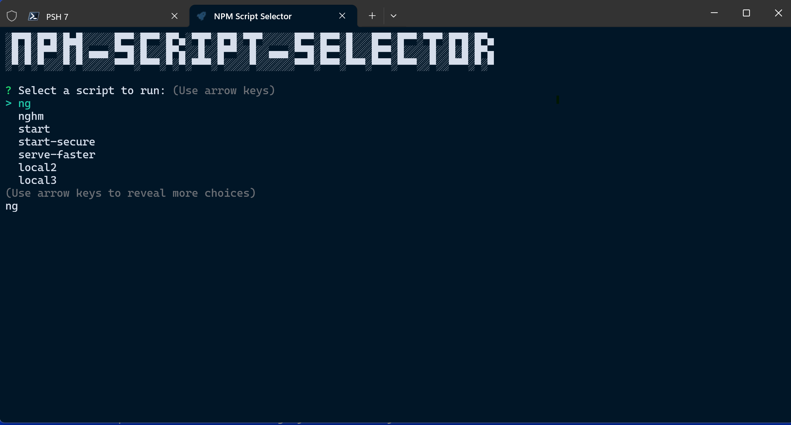

```text
░█▀█░█▀█░█▄█░░░░░█▀▀░█▀▀░█▀▄░▀█▀░█▀█░▀█▀░░░░░█▀▀░█▀▀░█░░░█▀▀░█▀▀░▀█▀░█▀█░█▀▄
░█░█░█▀▀░█░█░▄▄▄░▀▀█░█░░░█▀▄░░█░░█▀▀░░█░░▄▄▄░▀▀█░█▀▀░█░░░█▀▀░█░░░░█░░█░█░█▀▄
░▀░▀░▀░░░▀░▀░░░░░▀▀▀░▀▀▀░▀░▀░▀▀▀░▀░░░░▀░░░░░░▀▀▀░▀▀▀░▀▀▀░▀▀▀░▀▀▀░░▀░░▀▀▀░▀░▀
```

**By**: Justin Sunday<br>
**GitHub**: [sundayj/npm-script-selector](https://github.com/sundayj/npm-script-selector)<br>
**Website**: [JLSunday.com](https://jlsunday.com)

# NPM Script Selector

The NPM Script Selector is a CLI tool for discovering and running project scripts within `package.json` files. Have you ever worked on a project that contains so many scripts that you can't always remember the available options? That's what happened to me. I currently contribute to a project with 30+ scripts. I became tired of having to open the package file and/or IDE in order to find and run the needed the scripts, so I created this small CLI.

Currently, you provide the path to the `package.json` file, the NPM Script Selector will then list the available scripts for you, where you can interactively select the one you want. It will then run the script for you within the selected project's directory. I plan to add more functionality in the near future.

Uses `figlet`, `commander`, and `inquirer`.

## Features

- Accepts path to a `package.json` as an input.
- Lists scripts contained within that `package.json`.
- Allows interactive selection of script.
- Prints output from selected script.
- Asks if you would like to run another script when the current one is finished.

### Future Features

- [ ] - Allow subcommands/options to be passed to selected scripts.
- [ ] - Option to search for `package.json` files within a directory.
- [ ] - Option to store the paths of frequently used files.
- [ ] - Option to run the selected scripts in a new window.

## Installation and Usage

Install NPM Script Selector with npm:

```bash
  npm i -g npm-script-selector
```

To run:

```bash
> npmss -f path/to/desired/package.json
```

For Help:

```bash
> npmss -h

Usage: npmss [options]

A CLI for finding npm scripts within a `package.json` and allowing a user to run them from the command line.

Options:
  -V, --version       output the version number
  -f, --file <value>  Path to the package.json.
  -h, --help          display help for command

```

Path can be relative to current directory, or absolute.


